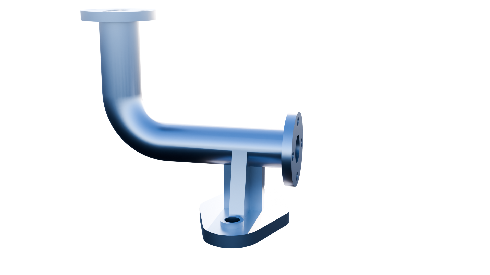

# Pipe Support Assembly

## Overview
This project is a custom pipe support assembly modeled in **SolidWorks**.  
The design features a flanged pipe with a 90° bend, mounted onto a structural support bracket with a bolted base plate.

The model was created to practice:
- Pipe routing and sweep features
- Flange modeling
- Structural support design

---

## Preview

---

## Features
- 90° pipe elbow design
- Dual flanged pipe connections
- Support bracket with reinforced ribs
- Base plate mounting holes
- Smooth curved geometry using sweeps and fillets

---

## Software Used
- SolidWorks

---

## Modeling Techniques
The following SolidWorks tools/features were used:
- Extrude Boss/Base
- Sweep
- Fillet
- Reference Geometry

---

## Purpose
This model was created as part of CAD practice to improve mechanical design and 3D modeling skills.

---